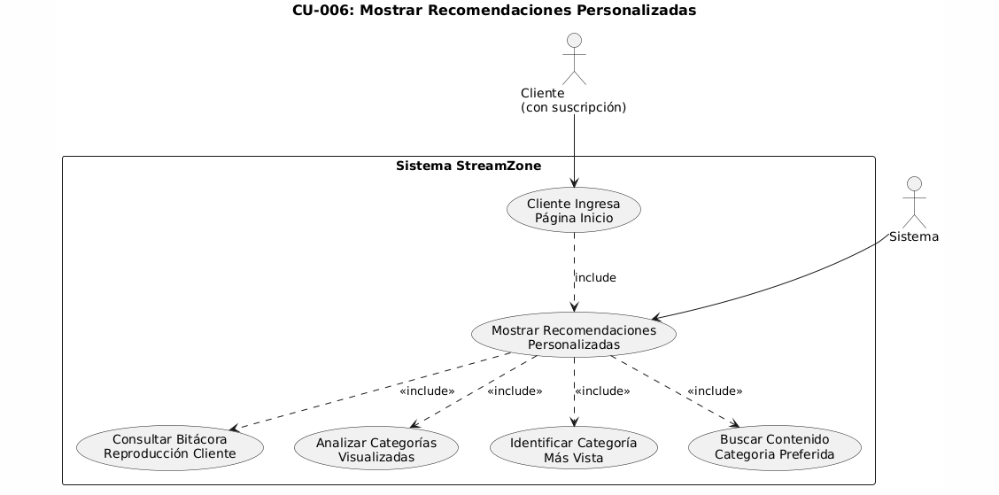

#  Manual Técnico – StreamZone

## 1. Elección y Justificación del Framework

- *Framework Seleccionado: **React* v19.1.0
- *Routing*: react-router-dom v7.7.1
- *Estilos*: MUI + TailwindCSS

### Justificación:
1. *Ecosistema maduro y popular*: Amplia comunidad, abundante documentación y librerías disponibles.
2. *Arquitectura basada en componentes*: Fomenta la reutilización, mantenibilidad y escalabilidad.
3. *Virtual DOM*: Permite alta eficiencia en interfaces dinámicas.
4. *Integración fluida con API REST y librerías como Axios o Redux*.
5. *Compatibilidad multiplataforma*: Fácil despliegue en Docker y plataformas como Vercel o Netlify.

## 2. Elección y Justificación del Patrón de Diseño

- *Patrón de Diseño Utilizado: **Modelo-Vista-Controlador (MVC)*

### Implementación en React:
| Componente     | Descripción                                                                 |
|----------------|-----------------------------------------------------------------------------|
| *Modelo*      | Hooks, Context API y servicios de datos (Axios)                            |
| *Vista*       | Componentes funcionales (JSX + estilos con Tailwind o MUI)                 |
| *Controlador* | Funciones que manejan lógica, validaciones y flujo de datos en el frontend |

### Justificación:
- Separación de responsabilidades  
- Facilita pruebas unitarias y mantenimiento  
- Mejora la escalabilidad del sistema  
- Patrón común en backend y frontend (coherencia full-stack)

## 3. Casos de Uso de Alto Nivel

### CU-000: Casos de Uso de Alto Nivel - StreamZone

## 4. Casos de Uso Expandidos

> A continuación se listan los títulos de los casos de uso expandidos. Puedes insertar cada imagen de PlantUML debajo del título correspondiente:

### CU-001: Registrar Cliente  

### CU-002: Actualizar Datos de Cliente  

### CU-003: Contratar Suscripción  

### CU-004: Dar de Baja Suscripción  

### CU-005: Reproducir Contenido  

### CU-006: Mostrar Recomendaciones Personalizadas  

### CU-007: Gestionar Contenido  

### CU-008: Panel de Administración (Vista Detallada)  

## 5. Descripción de Requerimientos No Funcionales

| Categoría         | Descripción                                                                                   |
|-------------------|-----------------------------------------------------------------------------------------------|
| *Rendimiento*    | Las operaciones CRUD deben ejecutarse en ≤ 200 ms bajo condiciones normales.                 |
| *Seguridad*      | Autenticación JWT, cifrado de contraseñas (bcrypt), validación contra XSS e inyecciones SQL. |
| *Escalabilidad*  | Arquitectura desacoplada (React + API REST) con soporte para instancias horizontales.        |
| *Disponibilidad* | Uptime ≥ 99.5%. Soporte para balanceo de carga y escalado automático.                        |
| *Mantenibilidad* | Código modular, documentado y con cobertura de pruebas ≥ 80%.                                |
| *Portabilidad*   | Despliegue con Docker, compatible con múltiples entornos cloud.                              |

## 6. Requerimientos Funcionales

| ID       | Requerimiento Funcional                                                                 |
|----------|------------------------------------------------------------------------------------------|
| RF-001   | El sistema debe permitir el registro de nuevos clientes mediante un formulario.         |
| RF-002   | El sistema debe validar que el correo electrónico del cliente sea único.                |
| RF-003   | El cliente debe poder iniciar sesión usando su correo electrónico y contraseña.         |
| RF-004   | El administrador debe poder iniciar sesión con sus credenciales.                        |
| RF-005   | El cliente debe poder actualizar sus datos personales y la información de su tarjeta.   |
| RF-006   | El cliente debe poder contratar un plan de suscripción y asociar su cuenta con una tarjeta. |
| RF-007   | El cliente debe poder cancelar su suscripción en cualquier momento.                     |
| RF-008   | El cliente debe poder visualizar contenido audiovisual desde un reproductor integrado.  |
| RF-009   | El sistema debe registrar una bitácora de los contenidos visualizados por cada cliente. |
| RF-010   | El sistema debe mostrar recomendaciones personalizadas en la página de inicio del cliente. |
| RF-011   | El administrador debe poder registrar nuevo contenido (películas, series, trailers, etc.). |
| RF-012   | El sistema debe permitir cerrar sesión de forma segura para cualquier usuario.          |
